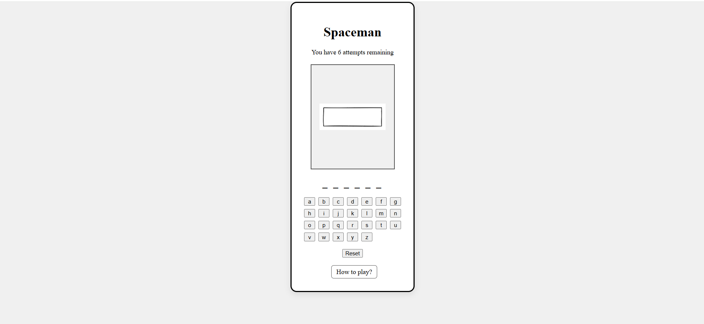

# Space Man game 

_A super cute find the words game._



## Getting Started

### Play the game

[Deployed game](https://aliabdulla2002.github.io/spaceman-game/)

### How to Play

1. A random space themed word gets picked when the game starts.
2. Click letters on the on-screen keyboard to guess letters in the word.
3. Correct letters fill in the blanks. Wrong letters cost you one attempt.
4. You have 6 attempts. The spaceman image changes with every wrong guess.
5. Guess the whole word before you run out of attempts to win!
6. Press Reset anytime to start a new game with a new word.

### Installation

No installaiton requierd! Simply clone the repo to your machine and open the `index.html` file in your browser.

```bash
git clone
cd memory
open index.html
```

### Technologies Used

- **HTML**
- **CSS**
- **JAVASCRIPT**

### Future Enhancment

### Credits